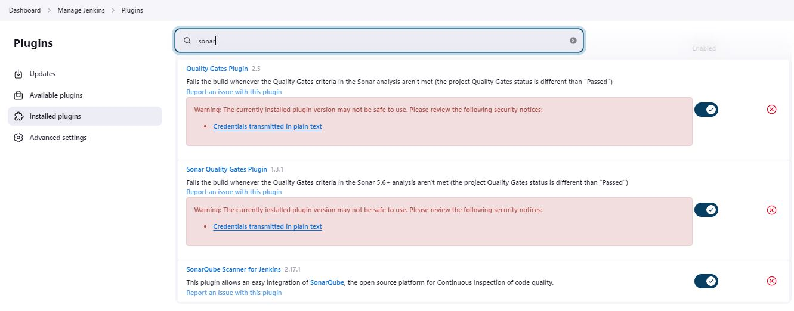
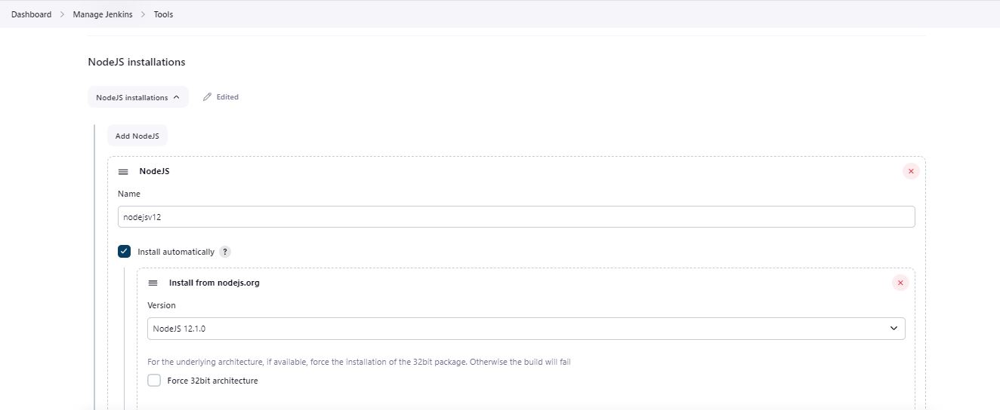
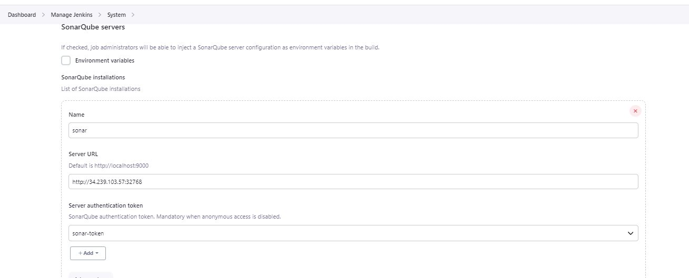
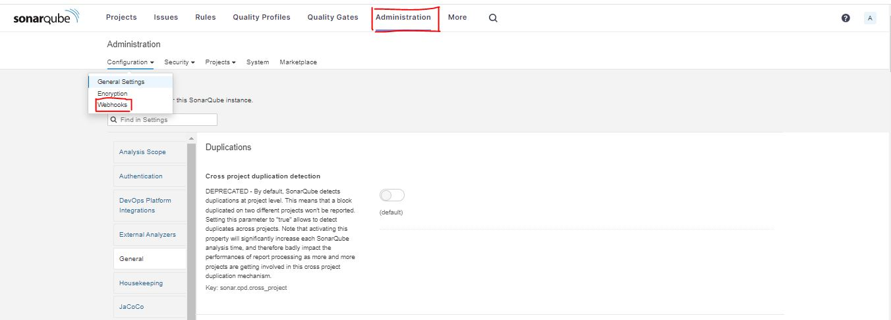
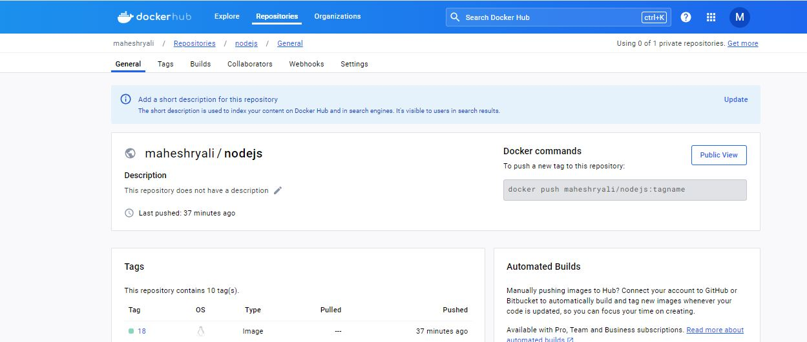
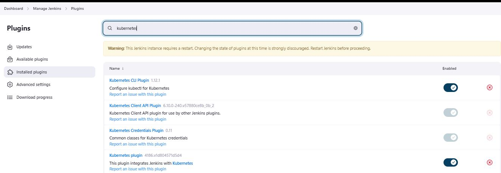
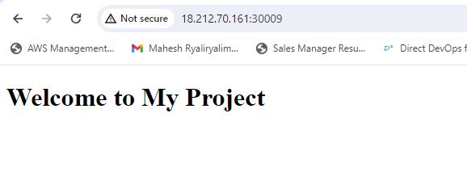
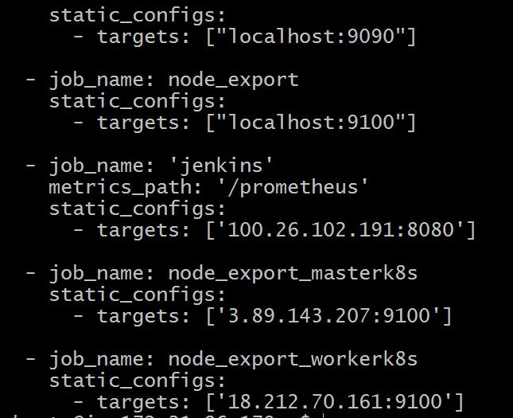

# Nodejs Application 
## About the project
 Deploying Nodejs microservice to kubernetes cluster by using different devops tools such as
 Jenkins, Github, Docker, Kubernetes, Terraform, SonarQube, Trivy, owasp dependency, Prometheus and Graphana and  AWS services.

# Getting Started

### Configure Jenkins server, Docker, Trivy:
  * Create Jenkins server by using Terraform (terraform configuration files) and by executing the following commands.
  * To store the statefile we needs backends as s3 in aws and for state locking create dynamodb.
    `Terraform init`,
  `Terraform apply -var-file="dev.tfvars" -auto-approve`
  
  * Install docker and trivy in the server.
   
    
### Run sonarqube container by using Docker and configured in jenkins:
  * Run the sonarqube container by using following command.
    
      `Docker container run -d -P sonarqube:latest`

    
  * Install the following plugins in jenkins.
        - Eclipse Temurin Installer
        - SonarQube Scanner
        - NodeJs Plugin

    
    
    
### Configure nodejs in global tool configuration:
  * Goto manage jenkins => Tools => Install nodejs(12) ==> click on Apply and save

    

### Configuring sonarqube server in manage jenkins:
  * Create a secret token in Sonar server and copy the token.
  * Go to Jenkins dashboard => manage Jenkins => credentials => Add Secret Text  
  * Configure the sonar Dashboard => Manage Jenkins => system
    
  * Install sonar scanner in the tools.

  * In the sonarqube add a quality gate 
    Administration => configuration => webhooks
     

  * Add the details in url section of quality gate
    `<http://jenkins-public-ip:8080>/sonarqube-webhook/`
     
  * Create a job and add the script in the declarative pipeline.
    ```
    pipeline {
    agent any
    tools {
        jdk 'jdk17'
        nodejs 'nodejsv12'
    }
    environment {
        SCANNER_HOME=tool 'sonarscanner'
    }
    triggers { pollSCM('* * * * *') }
    stages {
        stage('clean workspace'){
            steps{
                cleanWs()
            }
        }
        stage('clone_the_code') {
            steps {
                git branch: 'master',
                       url: 'https://github.com/maheshryali/example-app-nodejs-backend-react-frontend.git'
            }
        }
        stage('sonar_scan') {
            steps {
                withSonarQubeEnv('sonar') {
                    sh ''' $SCANNER_HOME/bin/sonar-scanner -Dsonar.projectName=examplenodejs \
                    -Dsonar.projectKey=examplenodejs '''
                }
            }
        }
        stage('Quality_gate') {
            steps {
                script {
                    *waitForQualityGate abortPipeline: false, credentialsId: 'sonar-token'
                }
            }
        }
        stage('Install dependencies') {
            steps {
                sh 'npm install'
            }
        }
}
}
    ```   
  * Build the declarative pipeline in jenkins server. After executing the build we will get the following output.

  


### Configure docker and build, push the image to Docker hub:
  * Go to Dashboard => Manage Plugins => Available plugins => Search for Docker and install these plugins.
    - Docker
    - Docker Commons
    - Docker Pipeline
    - Docker API
    - docker-build-step   
  * Install docker tool in Goto Dashboard => Manage Jenkins => Tools => Docker installations

     
  * Add docker hub username and password in Dashboard => Manage jenkins => credentials => system
  * Add the below stage to declarative pipeline.
  ```
  stage('Docker_build_push') {
            steps {
                script {
                    withDockerRegistry(credentialsId: 'docker', toolName: 'docker') {
                        sh """
                        docker image build -t nodejs:${BUILD_ID} .
                        docker tag nodejs:${BUILD_ID} maheshryali/nodejs:${BUILD_ID}
                        docker image push maheshryali/nodejs:${BUILD_ID}
                        """
                    }
                }
            }
        }
  ```
  * After pushing the image with specific tag to the docker hub output as shown below.
    

### Configure Kubernetes
  * Take two ubuntu instances one for k8s master and one for kubernetes worker node.
  * Copy the config file to the local directory present in kubernetes master.
  * The config present in the following directory
  `/home/ubuntu/.kube.config`
  * Install kubectl in Jenkins master and in both kubernetes nodes.
  * Install the following plugins in jenkins server.
    - kubernetes credentials
    - kubernetes Client API
    - Kubernetes 
    - Kubernetes cli
    
  * Add the config to the jenkins credentials i.e.., Goto manage Jenkins => manage credentials => Click on Jenkins global ==> add credentials
  * Create secret in kubernetes master for docker to login in kubernetes master for pulling the images from docker hub.Add the below step in kubernetes manifest file.
  ```
  imagePullSecrets:
        - name: regcred 
  ```
    
  * Add below step to declarative pipeline for trivy and kubenetes.
  ```
  stage('Trivy_scan') {
            steps {
                sh "trivy image maheshryali/nodejs:${BUILD_ID} > trivyimage.txt"
            }
        }
        stage('Deploy_application_to_k8s') {
            steps {
                script {
                    dir('kubernetes') {
                        withKubeConfig(caCertificate: '', clusterName: '', contextName: '', credentialsId: 'k8s', namespace: '', restrictKubeConfigAccess: false, serverUrl: '') {
                            sh """
                            kubectl apply -f deployment.yaml
                            kubectl apply -f service.yaml
                            """
                        }
                    }
                }
            }
        }
  ```
  * After executing the deployment and service file. Navigate to http://<ipaddress>:port. We will see the output as below.

  * 

  * The stage view of overall build stages.
  

### Configuring Prometheus and Graphana:
  * Install prometheus, node exporter, graphana in ubuntu server.
  * In the prometheus server add the details of jenkins, graphana, k8s master and worker node by changing the below file. `sudo vim /etc/prometheus/prometheus.yml`
  
  
  * We will see the metrics in graphana.
    
    


    
